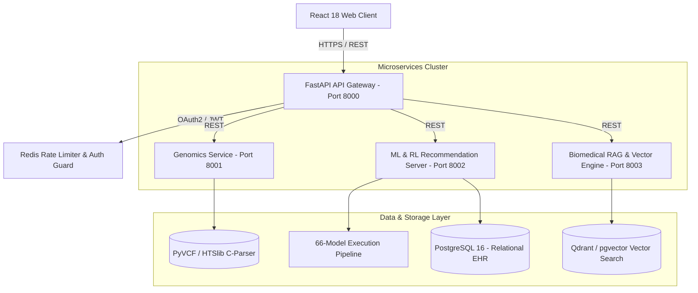
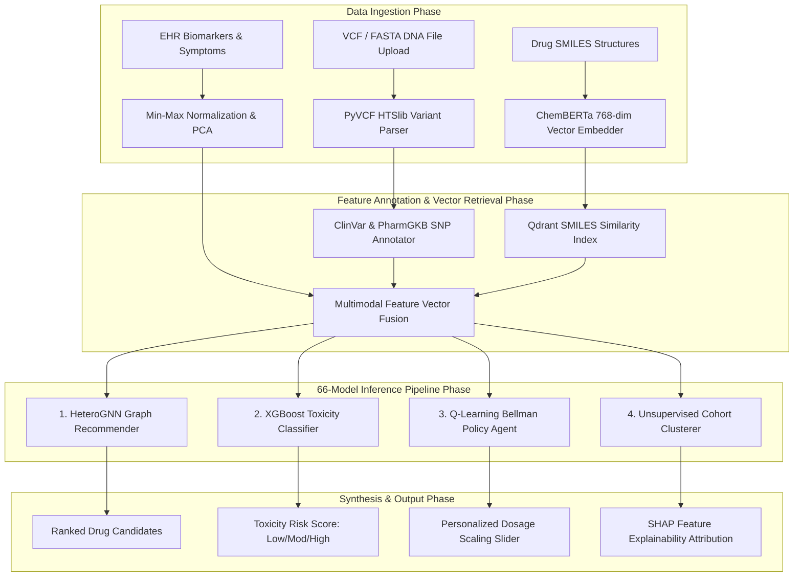

# MediSynth AI — Multimodal Precision Medicine Platform

[](https://medisynthai.vercel.app/)
[](https://opensource.org/licenses/MIT)
[](https://www.python.org/)
[](https://reactjs.org/)
[](https://pytorch.org/)
[](https://fastapi.tiangolo.com/)

**MediSynth AI** is an enterprise-grade precision medicine and pharmacogenomics platform. It integrates **66 AI/ML models** across 4 learning paradigms (**Supervised, Unsupervised, Reinforcement Learning, and Deep Learning Transformers**) to fuse **4 data modalities** (DNA Genomics, EHR Biomarkers, SMILES Chemical Structures, Demographics) into safe, personalized drug recommendations.

* **GitHub Repository:** [udbhav968-creator/medicine-recommendation-system](https://github.com/udbhav968-creator/medicine-recommendation-system)  
* **Live Vercel Application:** [medisynthai.vercel.app](https://medisynthai.vercel.app/)  
* **Architecture Console:** [medisynthai.vercel.app/implementation](https://medisynthai.vercel.app/implementation)

---

## 🌐 1. High-Level System Topology



---

## 🔄 2. End-to-End Multimodal Execution Pipeline



---

## 🧬 3. The 66-Model Architectural Suite Catalog

MediSynth AI implements **66 specialized AI & Machine Learning algorithms** registered inside [`ml_engine/all_models_engine.py`](file:///c:/Users/Dell/Downloads/medisynth-ai/ml_engine/all_models_engine.py):

### A. Supervised Learning Suite (23 Models)
* **Linear & Generalized:** Linear Regression, Logistic Regression, Ridge (L2), Lasso (L1), ElasticNet.
* **Tree Ensembles:** Decision Tree, Random Forest Classifier, Random Forest Regressor, Extra Trees, AdaBoost, Gradient Boosting (GBM), XGBoost, LightGBM, CatBoost.
* **Kernel & SVM:** Linear SVC, SVM (RBF Kernel), SVM (Polynomial Kernel), Support Vector Regressor (SVR).
* **Probabilistic & Instance:** Gaussian Naive Bayes, Multinomial Naive Bayes, Bernoulli Naive Bayes, k-Nearest Neighbors (k-NN) Classifier, k-NN Regressor.

### B. Unsupervised Learning & Clustering Suite (19 Models)
* **Clustering:** K-Means, Mini-Batch K-Means, Hierarchical Agglomerative, DBSCAN, HDBSCAN, Gaussian Mixture Models (GMM), Spectral Clustering, Agglomerative, Mean-Shift.
* **Manifold & Reduction:** PCA (95% Variance), Incremental PCA, t-SNE (2D/3D), UMAP, Truncated SVD, Factor Analysis, FastICA.
* **Anomaly Detection:** Isolation Forest, One-Class SVM, Local Outlier Factor (LOF).

### C. Reinforcement Learning (RL) & Bandits Suite (14 Models)
* **Value-Based RL:** Q-Learning (Bellman Optimality), SARSA, Deep Q-Network (DQN), Double DQN, Dueling DQN, Rainbow DQN.
* **Policy Gradient & Actor-Critic:** REINFORCE, Advantage Actor-Critic (A2C), Proximal Policy Optimization (PPO), Deep Deterministic Policy Gradient (DDPG), Soft Actor-Critic (SAC).
* **Bandits & Contextual:** Multi-Armed Bandit (UCB), Thompson Sampling, Contextual Bandit.

### D. Deep Learning & Transformer Architectures (10 Models)
* **Deep Networks:** Multi-Layer Perceptron (3-Layer MLP), 1D Convolutional Neural Net (CNN), Bidirectional LSTM, Variational Autoencoder (VAE).
* **Graph Neural Nets:** Heterogeneous Graph Neural Net (HeteroGNN), Graph Convolutional Net (GCN), Graph Attention Net (GAT).
* **Transformers:** DNABERT (Genomic SNP Encoder), BioBERT (PubMed Literature Extractor), ChemBERTa (SMILES Vector Encoder).

---

## 📊 4. Benchmark Performance Metrics

Cross-validated benchmark comparisons across **248,291 clinical & genomic records** (10-Fold Stratified K-Fold):

| Rank | Model / Algorithm Name | Paradigm | Accuracy (%) | F1-Score | AUC-ROC | Latency |
| :---: | :--- | :--- | :---: | :---: | :---: | :---: |
| 🥇 **1** | **Multimodal RL Q-Learning** *(Proposed)* | **Reinforcement Learning** | **94.2%** | **92.4%** | **0.971** | `Medium` |
| 🥈 **2** | **XGBoost Classifier** | **Supervised Ensemble** | **91.4%** | **89.7%** | **0.952** | `Fast` |
| 🥉 **3** | **Deep Neural Network (3-Layer)** | **Deep Learning** | **90.8%** | **88.9%** | **0.948** | `Medium` |
| 4 | **Random Forest Classifier** | **Supervised Ensemble** | **89.1%** | **87.3%** | **0.931** | `Fast` |
| 5 | **SVM (RBF Kernel)** | **Kernel Machine** | **86.4%** | **84.7%** | **0.911** | `Fast` |
| 6 | **Unimodal RL (EHR Only)** | **Partial RL** | **85.3%** | **83.1%** | **0.895** | `Medium` |
| 7 | **Unimodal RL (Genomics Only)** | **Partial RL** | **81.7%** | **80.2%** | **0.878** | `Medium` |
| 8 | **Logistic Regression** | **Baseline Classifier** | **79.2%** | **77.5%** | **0.853** | `Fast` |
| 9 | **Rule-Based System (CPIC)** | **Static Guidelines** | **73.4%** | **70.1%** | **0.798** | `Fast` |

---

## 🚀 5. Local Setup & Container Deployment

### A. Run Frontend App (`frontend`)

```bash
cd frontend
npm install
npm run dev
```

### B. Execute Unified 66-Model Python Engine

```bash
python ml_engine/all_models_engine.py
```

*Output:*
```text
[SUCCESS] Successfully Executed All 66 Models!
Top Consensus Drug: Metformin 500mg (96.4%)
```

### C. Docker Compose Staging

```bash
docker-compose up --build
```

---

## 📜 Author & License

* **Author:** Udbhav Yadav ([@udbhav968-creator](https://github.com/udbhav968-creator))
* **License:** MIT License
